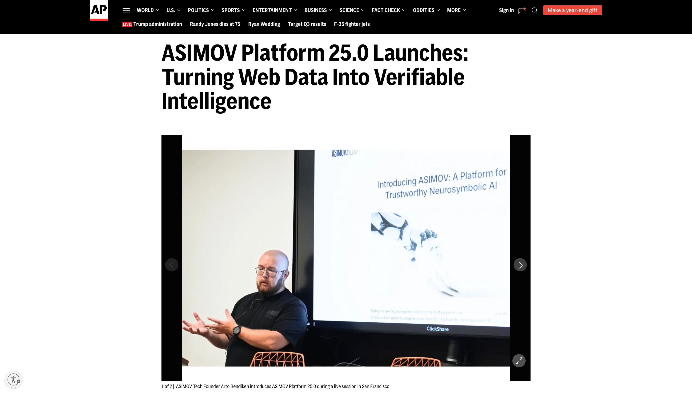

# ASIMOV DevLabs Workshops

*Hosted by Arto ([X](https://x.com/bendiken), [LinkedIn](https://www.linkedin.com/in/arto/))
& Tom ([X](https://x.com/TomFellenzAIPM), [LinkedIn](https://www.linkedin.com/in/tomfellenz/))
from [ASIMOV](https://x.com/ASIMOV_Protocol).*

- [Events](#events)
- [Background](#background)
- [QR Code](#qr-code)

## Events

- [Tuesday, November 25](https://luma.com/ne0t516s) in Mountain View
- [Wednesday, November 19](https://luma.com/x9i5ca56) in Oakland
- [Wednesday, November 12](https://luma.com/flmq0i8c) in San Francisco (Downtown)

## Background

### 2025-11-07

[ASIMOV Platform 25.0 Launches: Turning Web Data Into Verifiable Intelligence](https://apnews.com/press-release/ein-presswire-newsmatics/asimov-platform-25-0-launches-turning-web-data-into-verifiable-intelligence-663eb0635758f34ab27aef7d1c04b4c4)

### 2025-07-01

[Introducing ASIMOV: A Platform for Trustworthy Neurosymbolic AI](https://asimov.blog/introducing-asimov/)

## QR Code

