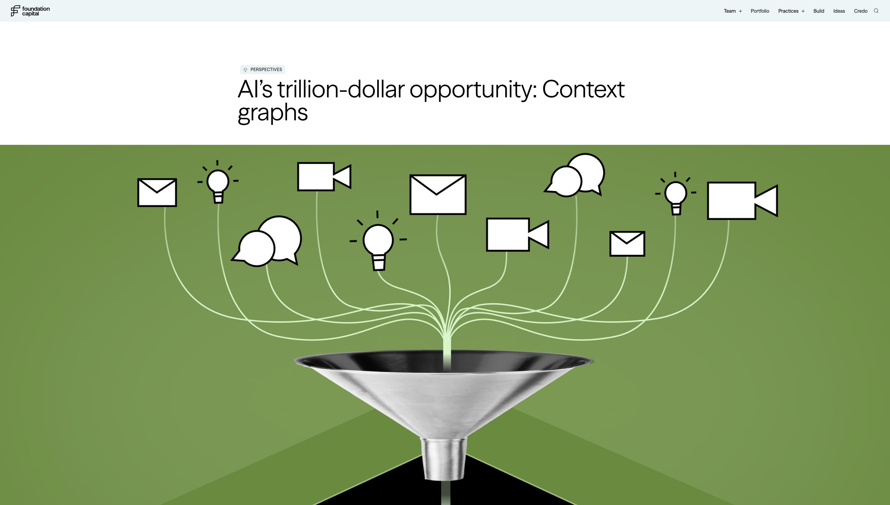
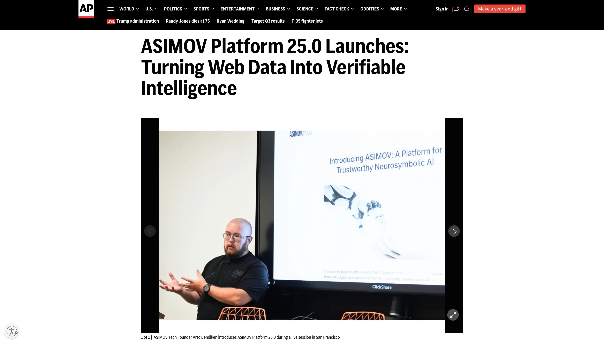

# ASIMOV DevLabs Workshops

*Hosted by Arto (arto@asimov.systems, [X](https://x.com/bendiken), [LinkedIn](https://www.linkedin.com/in/arto/))
& Tom (tom@asimov.systems, [X](https://x.com/FellenzMusic), [LinkedIn](https://www.linkedin.com/in/tomfellenz/))
from [ASIMOV](https://asimov.systems).*

- [Events](#events)
- [Reference](#reference)
- [Modules](#modules)
- [Reading](#reading)
- [Asks](#asks)

<p align="center"></p>

## [Events](https://luma.com/asimov-sf)

When | Weekday | Where | Venue
:--- | :------ | :---- | :----
[April 2](https://luma.com/3m6y5xeo) | Thursday | Mountain View | [Circuit Launch]
[March 19](https://luma.com/8ewasi4c) | Thursday | San Francisco | TBD
[March 12](https://luma.com/y1eszitt) | Thursday | San Francisco (Downtown) | [Cole Frieman & Mallon]
[March 5](https://luma.com/9n47y8c4) | Thursday | Oakland | [Circuit Launch]
[December 11](https://luma.com/sh47gs22) | Thursday | San Francisco | Homebrew Club
[November 25](https://luma.com/ne0t516s) | Tuesday | Mountain View | [Circuit Launch]
[November 19](https://luma.com/x9i5ca56) | Wednesday | Oakland | [Circuit Launch]
[November 12](https://luma.com/flmq0i8c) | Wednesday | San Francisco (Downtown) | [Cole Frieman & Mallon]

## Instructions

### 1. Install the [ASIMOV Command-Line Interface (CLI)](https://github.com/asimov-platform/asimov-cli)

```bash
brew install asimov-platform/tap/asimov-cli  # macOS with Homebrew
scoop install asimov-platform/asimov-cli     # Windows with Scoop
cargo install asimov-cli                     # any platform with Rust
```

> [!TIP]
> *PS. If you need it, the quickest way to install an up-to-date Rust toolchain is [`rustup`](https://rustup.rs)*

### 2. Install ASIMOV Modules

```bash
asimov module install all                    # all ~30 public modules
asimov module install luma                   # a specific module
```

## [Modules](https://asimov.directory/modules)

Name | Label | Summary | Package
:--- | :---- | :------ | :------------------------------------------------------
[anthropic](https://github.com/asimov-modules/asimov-anthropic-module) | Anthropic | LLM inference powered by Anthropic. | [🦀](https://crates.io/crates/asimov-anthropic-module)
[apify](https://github.com/asimov-modules/asimov-apify-module) | Apify | Data import powered by the Apify web automation platform. | [🦀](https://crates.io/crates/asimov-apify-module)
[brightdata](https://github.com/asimov-modules/asimov-brightdata-module) | Bright Data | Data import powered by the Bright Data web data platform. | [🦀](https://crates.io/crates/asimov-brightdata-module)
[chromium](https://github.com/asimov-modules/asimov-chromium-module) | Chromium | Chromium (and Brave, Google Chrome, Arc) bookmark import. | [🦀](https://crates.io/crates/asimov-chromium-module)
[ftp](https://github.com/asimov-modules/asimov-ftp-module) | FTP | FTP/FTPS protocol support. | [🦀](https://crates.io/crates/asimov-ftp-module)
[gemini](https://github.com/asimov-modules/asimov-gemini-module) | Gemini | LLM inference powered by Gemini. | [🦀](https://crates.io/crates/asimov-gemini-module)
[http](https://github.com/asimov-modules/asimov-http-module) | HTTP | HTTP/HTTPS protocol support. | [🦀](https://crates.io/crates/asimov-http-module)
[imap](https://github.com/asimov-modules/asimov-imap-module) | IMAP | IMAP email import. | [🦀](https://crates.io/crates/asimov-imap-module)
[ipfs](https://github.com/asimov-modules/asimov-ipfs-module) | IPFS | IPFS protocol support. | [🦀](https://crates.io/crates/asimov-ipfs-module)
[jinja](https://github.com/asimov-modules/asimov-jinja-module) | Jinja | Prompt templating using the Jinja templating language. | [🦀](https://crates.io/crates/asimov-jinja-module)
[jq](https://github.com/asimov-modules/asimov-jq-module) | JQ | JSON transformation using the jq filter language. | [🦀](https://crates.io/crates/asimov-jq-module)
[linkup](https://github.com/asimov-modules/asimov-linkup-module) | LinkUp | A LinkedIn API powered by LinkUp | [🦀](https://crates.io/crates/asimov-linkup-module)
[luma](https://github.com/asimov-modules/asimov-luma-module) | Luma | ASIMOV module for importing luma events. | [🦀](https://crates.io/crates/asimov-luma-module)
[maildir](https://github.com/asimov-modules/asimov-maildir-module) | Maildir | Maildir email import. | [🦀](https://crates.io/crates/asimov-maildir-module)
[mbox](https://github.com/asimov-modules/asimov-mbox-module) | Mbox | Mbox email import. | [🦀](https://crates.io/crates/asimov-mbox-module)
[mlx](https://github.com/asimov-modules/asimov-mlx-module) | MLX | LLM inference powered by MLX. | [🦀](https://crates.io/crates/asimov-mlx-module)
[near](https://github.com/asimov-modules/asimov-near-module) | NEAR Protocol | Data import from the NEAR Protocol blockchain network. | [🦀](https://crates.io/crates/asimov-near-module)
[ollama](https://github.com/asimov-modules/asimov-ollama-module) | Ollama | LLM inference powered by Ollama. | [🦀](https://crates.io/crates/asimov-ollama-module)
[openai](https://github.com/asimov-modules/asimov-openai-module) | OpenAI | LLM inference powered by OpenAI. | [🦀](https://crates.io/crates/asimov-openai-module)
[qdrant](https://github.com/asimov-modules/asimov-qdrant-module) | Qdrant | Knowledge indexing using the Qdrant vector database. | [🦀](https://crates.io/crates/asimov-qdrant-module)
[readwise](https://github.com/asimov-modules/asimov-readwise-module) | Readwise | Data import powered by the Readwise platform via official API endpoints. | [🦀](https://crates.io/crates/asimov-readwise-module)
[serpapi](https://github.com/asimov-modules/asimov-serpapi-module) | SerpApi | Data import powered by the SerpApi search data platform. | [🦀](https://crates.io/crates/asimov-serpapi-module)
[signal](https://github.com/asimov-modules/asimov-signal-module) | Signal | Signal chats import. | [🦀](https://crates.io/crates/asimov-signal-module)
[telegram](https://github.com/asimov-modules/asimov-telegram-module) | Telegram | Data import from a Telegram account | [🦀](https://crates.io/crates/asimov-telegram-module)
[template](https://github.com/asimov-modules/asimov-template-module) | Template | Fork this to create your own module! | [🦀](https://crates.io/crates/asimov-template-module)
[valkey](https://github.com/asimov-modules/asimov-valkey-module) | Valkey | Valkey and Redis integration for data cataloging, publishing, and subscribing. | [🦀](https://crates.io/crates/asimov-valkey-module)
[vcard](https://github.com/asimov-modules/asimov-vcard-module) | vCard | vCard (VCF) file format support. | [🦀](https://crates.io/crates/asimov-vcard-module)
[x](https://github.com/asimov-modules/asimov-x-module) | X | Data import powered by the X platform via official API endpoints. | [🦀](https://crates.io/crates/asimov-x-module)
[xai](https://github.com/asimov-modules/asimov-xai-module) | xAI | LLM inference powered by xAI. | [🦀](https://crates.io/crates/asimov-xai-module)

## Reading

### 2025-12-22 Foundation Capital

[](https://foundationcapital.com/ideas/context-graphs-ais-trillion-dollar-opportunity)

[AI’s Trillion-Dollar Opportunity: Context Graphs](https://foundationcapital.com/ideas/context-graphs-ais-trillion-dollar-opportunity)

### 2025-11-07 Associated Press

[](https://apnews.com/press-release/ein-presswire-newsmatics/asimov-platform-25-0-launches-turning-web-data-into-verifiable-intelligence-663eb0635758f34ab27aef7d1c04b4c4)

[ASIMOV Platform 25.0 Launches: Turning Web Data Into Verifiable Intelligence](https://apnews.com/press-release/ein-presswire-newsmatics/asimov-platform-25-0-launches-turning-web-data-into-verifiable-intelligence-663eb0635758f34ab27aef7d1c04b4c4)

### 2025-07-01 ASIMOV Blog

[](https://asimov.blog/introducing-asimov/)

[Introducing ASIMOV: A Platform for Trustworthy Neurosymbolic AI](https://asimov.blog/introducing-asimov/)

### Miscellaneous Background

- [KNOW: A Real-World Ontology for Knowledge Capture with Large Language Models](https://arxiv.org/abs/2405.19877)
- [Knowledge Graphs — What, Why, and How](https://samadritaghosh.medium.com/knowledge-graphs-what-why-and-how-84f920316ca5)
- [Why RDF Is the Natural Knowledge Layer for AI Systems](https://bryon.io/why-rdf-is-the-natural-knowledge-layer-for-ai-systems-a5fd0b43d4c5)
- [RDF 1.2 Primer](https://www.w3.org/TR/rdf12-primer/) & [RDF 1.2 Concepts and Abstract Data Model](https://www.w3.org/TR/rdf12-concepts/)

## Asks

1. ⭐ Star on GitHub:
  [asimov-platform/asimov-cli](https://github.com/asimov-platform/asimov-cli),
  [asimov-platform/asimov.rs](https://github.com/asimov-platform/asimov.rs),
  [asimov-platform/asimov.py](https://github.com/asimov-platform/asimov.py),
  [flux-doctrine/awesome-fbp](https://github.com/flux-doctrine/awesome-fbp)

2. 👉 Follow on X (Twitter):
  [@ASIMOV_Protocol](https://x.com/ASIMOV_Protocol),
  [@bendiken](https://x.com/bendiken),
  [@FellenzMusic](https://x.com/FellenzMusic),
  [@lux](https://x.com/lux)

3. 🤝 Connect on LinkedIn:
  [ASIMOV Protocol](https://www.linkedin.com/company/asimov-protocol/),
  [Arto Bendiken](https://www.linkedin.com/in/arto/),
  [Tom Fellenz](https://www.linkedin.com/in/tomfellenz/),
  [Rob Kunkle](https://www.linkedin.com/in/robkunkle/)

4. ✅ Sign up for [early access to ASIMOV Personal Intelligence](https://id.asimov.systems/join/asimov-devlabs-5):

<p align="center"></p>

[Circuit Launch]: https://circuitlaunch.com
[Cole Frieman & Mallon]: https://colefrieman.com/contact/
